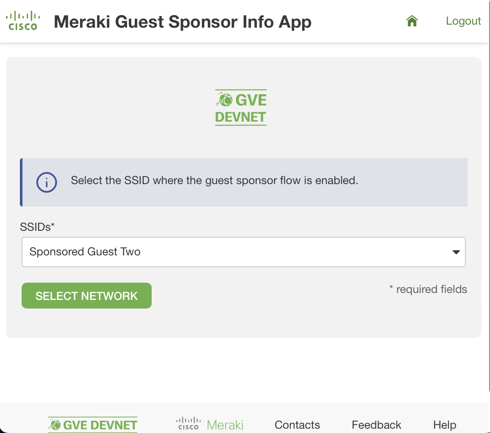

# GVE DevNet Meraki Guest Sponsor Info App
> Please note: this repository is an extension of the [Meraki Guest Sponsor Info](https://github.com/gve-sw/gve_devnet_meraki_guest_sponsor_info) script

Cisco Meraki provides a cloud-managed network with rich functionality. One of these functionalities is a _Sponsored Guest Login_, which allows guests to authenticate wirelessly and request access to the wireless network. Through a splash page, they will have to specify a _sponsor_ from the corporate domain. The sponsor will receive a confirmation email and verify that the guest wants to connect to the guest network. While the Meraki Dashboard does provide reporting and CSV exports about the wireless network, at the time of writing the default CSV reports do not include information about the sponsor and when the authorization expires. However, this information is available in the Meraki Dashboard. This prototype shows how to obtain the information from the Meraki Dashboard and display the information in a CSV report through a Python script. 

> Please note: this script uses both documented and undocumented API calls. Using undocumented API calls is at your own risk. In case the API call changes, then no support or limited support will be given.

Using the Flask app, we can create a CSV report in a few simple steps:

1. First, log in to the app using your Meraki Dashboard credentials:

2. Submit your API key:

3. Select the Meraki organization:

4. Select the Meraki network:

5. Select the SSID:

6. Download the CSV report, by clicking on the button download and obtain the following report:

## Contacts
* Simon Fang (sifang@cisco.com)

## Solution Components
* Python 3.8 or higher
* Meraki Dashboard
* Meraki MR
* Flask

## How to obtain a Meraki API Key

In order to use the Cisco Meraki API, you have to enable the API for your organization first. After having enabled API access, you can generate an API key. You can follow the following instructions on how to enable API access and how to generate an API key:

1. Log in to the Cisco Meraki dashboard

2. In the left-hand menu, go to `Organization > Settings > Dasbhoard API access`

3. Click on `Enable access to the Cisco Meraki Dashboard API`

4. Go to `Profile > API access`

5. Under `API access`, click on `Generate API key`

6. Save the API key in a safe place. Please note that the API key will be shown only once for security purposes. In case you lose the key, then you have to revoke the key and regenerate a new key. Moreover, there is a limit of only two API keys per profile. 

> For more information on how to generate an API key, please click here [here](https://documentation.meraki.com/General_Administration/Other_Topics/Cisco_Meraki_Dashboard_API)

> Note: Make sure this API key has write access to the organization. You can add your account as Full Organization Admin to the organization by following the instructions [here](https://documentation.meraki.com/General_Administration/Managing_Dashboard_Access/Managing_Dashboard_Administrators_and_Permissions).

## How to enable the Sponsored Guest flow
The Sponsored Guest flow allows guests to wirelessly authenticate themselves and gain access to the network through a sponsor. The sponsor needs to verify the identity of the guest. In the following section, it will be explained how to enable this flow:

1. Administrators navigate to **Wireless > Access Control**. Scroll down to **Splash Page** and select **Sponsored guest login**.

2. Specify the allowed **sponsor email domains** and the **maximum sponsorship duration**.

3. Click **save**.

> For more information, please refer to the [documentation](https://documentation.meraki.com/MR/Encryption_and_Authentication/Sponsored_Guest)

## Installation/Configuration

The following commands are executed in the terminal.

1. Create and activate a virtual environment for the project:
   
        #WINDOWS:
        $ py -3 -m venv [add_name_of_virtual_environment_here] 
        $ [add_name_of_virtual_environment_here]/Scripts/activate.bat 
        #MAC:
        $ python3 -m venv [add_name_of_virtual_environment_here] 
        $ source [add_name_of_virtual_environment_here]/bin/activate
        
> For more information about virtual environments, please click [here](https://docs.python.org/3/tutorial/venv.html)

2. Access the created virtual environment folder

        $ cd [add_name_of_virtual_environment_here]

3. Clone this repository

        $ git clone [add_link_to_repository_here]

4. Access the folder `gve_devnet_meraki_guest_sponsor_info_app`

        $ cd gve_devnet_meraki_guest_sponsor_info_app

5. Install the dependencies:

        $ pip install -r requirements.txt

## Usage
Now it is time to run your Flask application by typing in the following command in your terminal:

    $ python app.py

Now, go to your and type in the following url: https://127.0.0.1:5001

# Screenshots

### LICENSE

Provided under Cisco Sample Code License, for details see [LICENSE](LICENSE.md)

### CODE_OF_CONDUCT

Our code of conduct is available [here](CODE_OF_CONDUCT.md)

### CONTRIBUTING

See our contributing guidelines [here](CONTRIBUTING.md)

#### DISCLAIMER:
<b>Please note:</b> This script is meant for demo purposes only. All tools/ scripts in this repo are released for use "AS IS" without any warranties of any kind, including, but not limited to their installation, use, or performance. Any use of these scripts and tools is at your own risk. There is no guarantee that they have been through thorough testing in a comparable environment and we are not responsible for any damage or data loss incurred with their use.
You are responsible for reviewing and testing any scripts you run thoroughly before use in any non-testing environment.